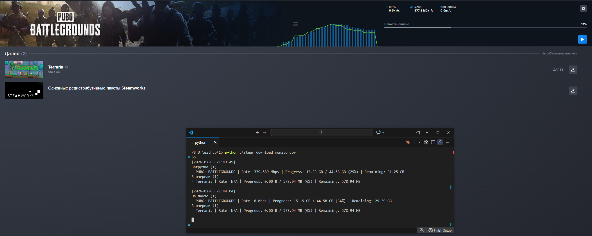

# steam-download-monitor

`steam-download-monitor` отслеживает загрузки и обновления Steam и выводит в консоль активную загрузку и очередь с прогрессом.

Требуется Python 3.10+.



## Установка (виртуальное окружение + pip)

Windows (PowerShell):

```powershell
python -m venv .venv
.\.venv\Scripts\Activate.ps1
pip install -e .
```

Linux/macOS (bash):

```bash
python3 -m venv .venv
source .venv/bin/activate
pip install -e .
```

## Запуск

Через Python:

```powershell
python steam_download_monitor.py
```

Если установлен как пакет:

```powershell
steam-download-monitor
```

## Использование

### Интерфейс командной строки

По умолчанию параметры берутся из `config.json` и `.env` (если есть). Переменные окружения перекрывают файл конфигурации.

Пример запуска с настройками через env:

```powershell
$env:STEAM_MONITOR_INTERVAL_SECONDS = '15'
$env:STEAM_MONITOR_SAMPLES = '20'
steam-download-monitor
```

Включить диагностику (DEBUG) и сохранить лог в файл:

```powershell
$env:STEAM_MONITOR_LOG_LEVEL = 'DEBUG'
$env:STEAM_MONITOR_LOG_FILE = 'monitor.log'
steam-download-monitor
```

### Python API

```python
from steam_monitor.app import main

raise SystemExit(main())
```

## Конфигурация

Настройки можно задавать:

* через файл конфигурации (`config.json`)
* через файл `.env`
* через переменные окружения

### Переменные окружения

| Переменная | По умолчанию | Описание |
| --- | ---: | --- |
| `STEAM_MONITOR_DOTENV` | `.env` | Путь к файлу `.env` |
| `STEAM_MONITOR_CONFIG` | `config.json` | Путь к JSON-конфигу |
| `STEAM_MONITOR_INTERVAL_SECONDS` | `15` | Интервал опроса, сек |
| `STEAM_MONITOR_SAMPLES` | `20` | Кол-во итераций вывода |
| `STEAM_MONITOR_TAIL_BYTES` | `524288` | Сколько байт читать с конца `content_log.txt` |
| `STEAM_MONITOR_LOG_LEVEL` | `INFO` | Уровень диагностических логов (DEBUG/INFO/WARNING/ERROR/CRITICAL) |
| `STEAM_MONITOR_LOG_FILE` | *(не задано)* | Файл для диагностических логов (если задан) |
| `STEAM_MONITOR_LOG_ENCODING` | `utf-8` | Кодировка чтения `content_log.txt` |
| `STEAM_MONITOR_TIMESTAMP_FORMAT` | `%Y-%m-%d %H:%M:%S` | Формат времени |
| `STEAM_MONITOR_STEAM_ROOT` | *(не задано)* | Путь к Steam (если авто-поиск не нашел установку) |
| `STEAM_MONITOR_LOG_REL_PATH` | `logs/content_log.txt` | Относительный путь лога от `SteamRoot` |
| `STEAM_MONITOR_LIBRARY_VDF_REL_PATH` | `steamapps/libraryfolders.vdf` | Относительный путь к `libraryfolders.vdf` |
| `STEAM_MONITOR_MANIFEST_PATTERN` | `steamapps/appmanifest_{appid}.acf` | Шаблон пути до манифеста |
| `STEAM_MONITOR_REGISTRY_PATHS` | *(см. `config.json`)* | Список путей реестра через `;` |
| `STEAM_MONITOR_REGISTRY_VALUES` | `InstallPath;SteamPath` | Список имен значений реестра через `;` |
| `STEAM_MONITOR_ROOT_CANDIDATES` | *(см. `config.json`)* | Список кандидатов путей Steam через `;` |

## Как это работает

1. Определяется `SteamRoot`: через `STEAM_MONITOR_STEAM_ROOT`, реестр Windows или авто-поиск по стандартным путям и запущенному процессу.
2. Читается хвост `logs/content_log.txt`.
3. Из лога определяется активный `AppID` и статус (загрузка/пауза/очередь), скорость берется из `Current download rate`, если строка актуальна.
4. По `steamapps/libraryfolders.vdf` находятся библиотеки Steam.
5. Из `steamapps/appmanifest_*.acf` собираются игры в очереди и прогресс (BytesDownloaded/BytesToDownload).
6. Результат выводится в консоль по разделам статусов.

## Ограничения

* `content_log.txt` обновляется с задержкой: при смене состояния скорость и статус могут появиться не сразу.
* Авто-поиск Steam может не найти нестандартные установки — задайте `STEAM_MONITOR_STEAM_ROOT` или `STEAM_MONITOR_ROOT_CANDIDATES`.

## Тесты

```powershell
pip install -e .[dev]
pytest
```

## License

Проект распространяется под лицензией MIT. См. файл [LICENSE](LICENSE).
